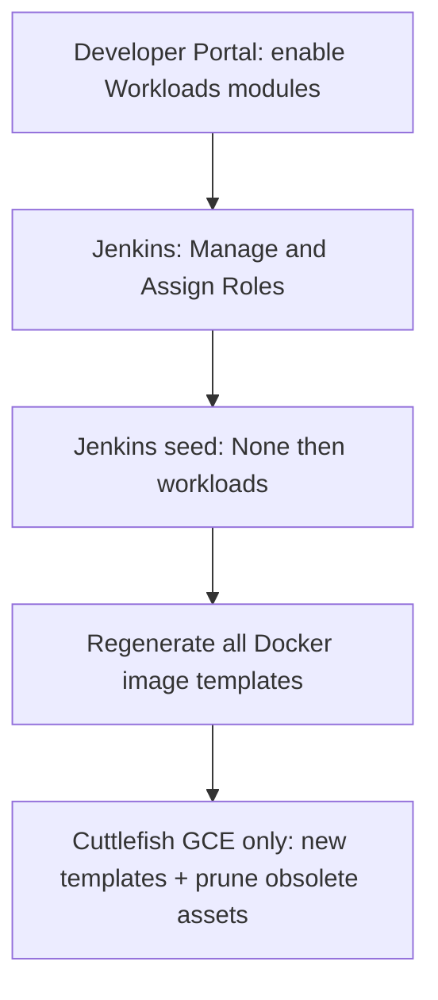

# Upgrade Guide: 3.1.0 to 4.0.0

This guide explains how to upgrade an existing Horizon SDV 3.1.0 environment to 4.0.0.

## Table of Contents

- [Overview](#overview)
- [Prerequisites](#prerequisites)
- [Configuration Placeholders](#configuration-placeholders)
- [Section #1 - Update the Repository](#section-1---update-the-repository)
- [Section #2 - Run the Deployment Script](#section-2---run-the-deployment-script)
- [Section #3 - Post-Upgrade Steps](#section-3---post-upgrade-steps)
  - [Section #3a - Update DNS entry](#section-3a---update-dns-entry)
  - [Section #3b - Access Argo CD](#section-3b---access-argo-cd)
  - [Section #3c - Wait for ExternalSecrets to Recover](#section-3c---wait-for-externalsecrets-to-recover)
  - [Section #3d - Delete and Recreate Affected Resources](#section-3d---delete-and-recreate-affected-resources)
  - [Section #3e - Workload upgrades (release checklist) - CI/CD](#section-3e---workload-upgrades-release-checklist---cicd)
- [Section #4 - Verification](#section-4---verification)
- [Troubleshooting](#troubleshooting)

---

## Overview

Release 4.0.0 introduces the following breaking changes that require manual intervention when upgrading a live 4.0.0 environment:

- **Add non-GitHub SCM repository support (TAA-1489):** terraform/env/terraform.tfvars.sample changes. SCM credentials for Jenkins were renamed in GitOps: the live Secret target is now jenkins-scm-creds (driven by jenkins-scm-creds-secret ExternalSecret in gitops/templates/jenkins-init.yaml), and CasC references jenkins-scm-creds jenkins secrets was renamed secrets. When migrating from release 3.1.0 or below to release 4.0.0, ArgoCD may show the `horizon-sdv` application as OutOfSync
Release 4.0.0 introduces the following breaking changes that require manual intervention when upgrading a live 3.1.0 environment:

- **Keycloak Roles and Groups consistency (TAA-1141):** Old group and clients were using groups for authentication and authorization which needs to be deleted. New groups `administrators`, `viewers` and `developers` have been created for simplicity. And these 3 new keycloak groups are integrated to use client roles for authentication and authorization.

---

## Prerequisites

Before starting the upgrade, ensure the following:

- The **3.1.0 environment is fully deployed and healthy**. All Argo CD applications must be `Synced` and `Healthy` before starting.
- You have access to new template `terraform/env/terraform.tfvars` ( based on `terraform/env/terraform.tfvars.sample`) and can run the deployment workflow.
- You have `kubectl` connectivity to the cluster. Refer to [Connect to GKE via Connect Gateway](../deployment_guide.md#section-3b---connect-to-gke-via-connect-gateway) if needed.
- You have the Argo CD admin credentials available. The admin password is stored in GCP Secret Manager under the secret named `argocd-admin-password-b64`.

---

## Configuration Placeholders

Throughout this guide the following placeholders are used. Replace them with your actual values.

| Placeholder      | Description                                                       | Example          |
|------------------|-------------------------------------------------------------------|------------------|
| `SUB_DOMAIN`     | The subdomain of your environment (`sdv_env_name` in tfvars)      | `sbx`            |
| `HORIZON_DOMAIN` | Your root domain (`sdv_root_domain` in tfvars)                    | `example.com`    |

---

## Section #1 - Update the Repository

Switch your local repository to the 4.0.0 branch (or the branch containing the 4.0.0 changes) and pull the latest changes.

```bash
git fetch origin
git checkout <BRANCH_NAME>
git pull
```

If your `terraform/env/terraform.tfvars` requires any updates for new variables introduced in 4.0.0, apply them now. Few required variables are introduced in this release. Refer to the [Deployment Guide – Configure Terraform Variables](../deployment_guide.md#section-2c---configure-terraform-variables) for the full variable reference.

---

## Section #2 - Run the Deployment Script

Run the standard deployment script from `tools/scripts/deployment`.

**Containerized deployment:**

> [!NOTE]
> If you already have the deployer container image from a previous deployment, remove it first so that a new image is built with the latest `deploy.sh` and repository code. For example: `docker rmi horizon-sdv-deployer:latest`. Then run the following from `tools/scripts/deployment`:

```bash
./container-deploy.sh --apply
```

**Linux Native deployment:**

```bash
./deploy.sh --apply
```

## Section #3 - Post-Upgrade Steps

### Section #3a - Update DNS entry

1. open GCP Console `https://console.cloud.google.com`
2. Search `Cloud DNS`
3. Click on your Zone from the list
4. Open NS (Name Server) from the list
5. Copy the zone’s nameservers from Cloud DNS and paste them as the domain’s NS records at your registrar.

### Section #3b - Access Argo CD

> [!IMPORTANT]
> The Horizon landing page will be temporarily broken during the upgrade due to the resources being deleted and recreated in the steps below. Use the direct Argo CD URL to access the UI.

Access Argo CD directly at:

```
https://<SUB_DOMAIN>.<HORIZON_DOMAIN>/argocd
```

Log in with the Argo CD admin credentials:
- **Username:** `admin`
- **Password:** Retrieve from GCP Secret Manager under the secret named `argocd-admin-password-b64`. Could be retrieve from terraform.tfvars configuration file manual_secrets named s5 ( if set)

### Section #3c - Wait for ExternalSecrets to Recover

Once `terraform apply` finishes successfully, the ExternalSecret and SecretStore resources managed by Argo CD will temporarily enter a **Degraded** health state. This happens because the ArgoCD namespace and related resources were migrated and the External Secrets Operator needs to re-establish its connections.

Wait until they recover to **Healthy**. This may take several minutes. To speed up recovery:

1. Open the `horizon-sdv` application in Argo CD (you are already logged in from the previous step).
2. Click the **Refresh** button, then click **Sync** if the application remains out of sync.

Do not proceed to the next section until all ExternalSecret and SecretStore resources are `Healthy`.

### Section #3d - Delete and Recreate Affected Resources

> [!IMPORTANT]
> Deleting the resources below will cause brief downtime for the affected applications.

#### ArgoCD OutOfSync: orphaned `jenkins-git-creds` secret after upgrade

When migrating from release 3.1.0 or below to release 4.0.0, ArgoCD may show the` horizon-sdv` application as OutOfSync. The diff shows resource `Secret/jenkins/jenkins-git-creds` (or prefixed namespace) with credentials present on one side and absent/empty on the other.

The previously orphaned Secret `jenkins-git-creds` may remain in the cluster after the upgrade.

Solution :

First, confirm that Jenkins CasC uses jenkins-scm-creds only and properly authenticates with Git SCM (GitHub, etc.).

ArgoCD, locate the `horizon-sdv` application (OutOfSync) and perform the following steps:

  - Secrets, find jenkins-git-creds (shown with empty Sync status). Click ... → Delete → select Non-cascading (Orphan) Delete → type the confirmation word → click OK.

  - External Secrets, find jenkins-git-creds-secret (shown with empty Sync status). If visible, repeat the Delete step from point 1.

  - Sync the `horizon-sdv` application with Prune enabled. When finished, the Sync Status should change to Synced.

  Step 1 and 2 could be done as kubectl commands:

  `kubectl delete secret jenkins-git-creds -n jenkins` 
  
  `kubectl delete externalsecret jenkins-git-creds-secret -n jenkins`  (could be not found)
Several resources must be deleted so that Argo CD can recreate them with the updated configuration. Follow the steps below in order.

#### Delete all the groups in Keycloak application

In Keycloak:

1. Navigate to `Groups` tab
   - Select all groups
   - Click on 3 dots option and select **Delete**.
   - This is required to clear unwanted groups
2. Navigate to `Clients` tab
   - Select/Open `argocd`
   - Click on "Action" dropdown button on the top right corner.
   - Select Delete
   - Repeat above steps for `grafana-oauth`, `jenkins` and `oauth2-headlamp`
3. Navigate to `Realm roles`
   - Select/Open `horizon-grafana-administrators`
   - Click on "Action" dropdown button on the top right corner.
   - Select Delete this role.
   - Repeat above steps for `horizon-grafana-viewers`, `horizon-jenkins-administrators`, `horizon-jenkins-workloads-developers` and `horizon-jenkins-workloads-users`.

#### Delete below apps using ArgoCD application

Login to ArgoCD using admin user:

1. Delete app - `Grafana`
2. Delete app - `Jenkins`
3. Delete app - `landingpage`

#### Sync the `horizon-sdv` application with Hard Refresh option

Once the above resources are deleted:

1. Click **Sync**.
2. Select `horizon-sdv` application.
3. Click **Synchronize**.
4. Click **Refresh Apps**
5. Select `horizon-sdv` application.
6. Select **Hard** option
7. Click **Refresh**

This will recreate all deleted resources with the updated 4.0.0 configuration.

### Section #3e - Workload upgrades (release checklist) - CI/CD

Use this checklist whenever you cut over to a new Horizon-SDV release that includes Workloads-related changes. The same operational steps apply for **in-place upgrades** and **clean / greenfield** deployments. For greenfield installs, also follow any ordering and prerequisite notes in the linked Workloads guides so dependencies (GitOps, secrets, Jenkins, and so on) are satisfied before you run jobs.

> [!IMPORTANT]
> This subsection is a **summary**. For exact parameters, job names, and sequencing, follow the authoritative guides in the [workloads documentation table](#workloads-documentation-authoritative) below—not this list alone.



#### Developer Portal — Workloads modules

Where Android workloads are required, enable modules in the **Horizon Developer Portal**:

1. Open **Administration → Modules** at
   `https://<SUB_DOMAIN>.<HORIZON_DOMAIN>/developer-portal/admin/modules`
2. Under **Administration**, enable **`workloads-common`**, then **`workloads-android`**, in that order.

Skip or adjust modules if your environment intentionally does not use Android workloads.

#### Jenkins — RBAC before seed

Before running **Seed Workloads**, ensure operators and developers who will seed or run Workloads jobs have **Role-based Authorization** assignments in Jenkins:

1. In Jenkins, open **Manage Jenkins** → **Manage and Assign Roles** → **Assign Roles**.
2. Map users to the correct **Global** and **Item** roles as described in the guides below.

Authoritative setup (Keycloak groups, role names, and **Assign Roles** steps): [Role Based Strategy — Pipeline Guide](../workloads/guides/pipeline_guide.md#rolebasedstrategy). Keycloak group membership: [Jenkins access via Keycloak groups](../deployment_guide.md#section-3d---jenkins-access-via-keycloak-groups).

#### Jenkins seed job

1. Run the **seed job once** with workload **`None`** so Jenkins job parameters refresh to match the new release.
2. Seed additional workloads as needed for your environment—for example **`all`**, **`android`**, **`openbsw`**, **`utilities`**, or other values your seed job supports.

See the [workloads documentation table](#workloads-documentation-authoritative).

#### Docker image templates

Regenerate **all** Docker image templates for **all** workloads you use (**full template coverage**) so built images pick up Dockerfile and template changes from the release. Run the jobs or pipelines described in each of the Workloads `docker_image_template` guides (Android, utilities, OpenBSW, and ABFS where applicable).

#### Android Cuttlefish — GCE instance templates

If you use Cuttlefish on GCE, **regenerate Cuttlefish instance templates from scratch** using the documented job or process, and **remove obsolete templates and related GCP resources** as part of that flow. The goal is to avoid leaving stale GCE assets that could be selected accidentally after an upgrade.

#### Workloads documentation (authoritative)

| Area | Documentation |
|------|----------------|
| Jenkins RBAC (**Manage and Assign Roles**) | [Pipeline Guide — Role Based Strategy](../workloads/guides/pipeline_guide.md#rolebasedstrategy); [Deployment Guide — Jenkins access via Keycloak groups](../deployment_guide.md#section-3d---jenkins-access-via-keycloak-groups) |
| Seed jobs & Jenkins parameters | [workloads/seed.md](../workloads/seed.md) |
| How pipelines and jobs fit together | [workloads/guides/pipeline_guide.md](../workloads/guides/pipeline_guide.md) |
| Docker image templates — Android | [workloads/android/environment/docker_image_template.md](../workloads/android/environment/docker_image_template.md) |
| Docker image templates — Utilities | [workloads/utilities/docker_image_template.md](../workloads/utilities/docker_image_template.md) |
| Docker image templates — OpenBSW | [workloads/openbsw/environment/docker_image_template.md](../workloads/openbsw/environment/docker_image_template.md) |
| Docker image templates — ABFS (where used) | [workloads/android/environment/abfs/docker_image_template.md](../workloads/android/environment/abfs/docker_image_template.md) |
| Cuttlefish GCE instance templates | [workloads/android/environment/cf_instance_template.md](../workloads/android/environment/cf_instance_template.md) |

---

## Section #4 - Verification

Once all post-upgrade steps are complete, verify the environment is healthy:

1. In Argo CD, confirm that all applications under `horizon-sdv` are `Synced` and `Healthy`.
2. Confirm the Horizon landing page is accessible at `https://<SUB_DOMAIN>.<HORIZON_DOMAIN>`.
3. Confirm that the following applications are reachable and functioning:
   - Landing Page: `https://<SUB_DOMAIN>.<HORIZON_DOMAIN>`
   - Argo CD: `https://<SUB_DOMAIN>.<HORIZON_DOMAIN>/argocd`
   - Keycloak: `https://<SUB_DOMAIN>.<HORIZON_DOMAIN>/keycloak`
   - Gerrit: `https://<SUB_DOMAIN>.<HORIZON_DOMAIN>/gerrit`
   - Jenkins: `https://<SUB_DOMAIN>.<HORIZON_DOMAIN>/jenkins`
   - MTK Connect: `https://<SUB_DOMAIN>.<HORIZON_DOMAIN>/mtk-connect`
   - MCP Gateway Registry: `https://mcp.<SUB_DOMAIN>.<HORIZON_DOMAIN>`
4. Confirm that assigning specific Keycloak Group and accessing applications is working fine.

---

## Troubleshooting

### Cloud DNS Error 400: existing records prevent zone replacement

```
Error: Error creating DnsAuthorization / Error 400: The resource already has records that cannot be replaced or removed.
```

This error occurs when the Cloud DNS zone already contains records (typically created by `external-dns` or a previous deployment) that conflict with what Terraform is trying to replace during the upgrade.

Resolution:

1. In Argo CD, delete the `external-dns` application (use **Non-cascading** delete so the namespace is preserved) to stop it from recreating DNS records during cleanup.
2. In GCP Console, navigate to **Network Services → Cloud DNS** and open your zone.
3. Delete all records in the zone **except** the `SOA` and `NS` records.
4. Re-run the deployment script:
   ```bash
   ./deploy.sh --apply
   # or
   ./container-deploy.sh --apply
   ```
5. After apply completes successfully, resync the `external-dns` application in Argo CD so it recreates the DNS records.

### Argo CD namespace stuck in `Terminating`

If the `argocd` namespace remains in a `Terminating` state for more than a few minutes after `terraform apply`, it is likely blocked by a finalizer on the `horizon-sdv` Argo CD `Application` resource whose controller was torn down during the migration. Remove the finalizer manually:

1. Remove the finalizer from the `horizon-sdv` Application:
   ```bash
   kubectl patch application horizon-sdv -n argocd \
     --type=json \
     -p='[{"op":"remove","path":"/metadata/finalizers"}]'
   ```
2. If the namespace is still stuck, remove its finalizers directly:
   ```bash
   kubectl patch namespace argocd \
     --type=json \
     -p='[{"op":"remove","path":"/metadata/finalizers"}]'
   ```
3. Terraform will recreate the namespace and all ArgoCD resources on the next apply.

### ExternalSecret or SecretStore remains Degraded after a long wait

If ExternalSecrets or SecretStores do not recover to `Healthy`:

1. Check the External Secrets Operator pod is running:
   ```bash
   kubectl get pods -n external-secrets
   ```
2. Force a refresh in Argo CD by clicking **Refresh** on the `horizon-sdv` application, then **Sync**.
3. If a specific ExternalSecret continues to fail, check its events:
   ```bash
   kubectl describe externalsecret <NAME> -n <NAMESPACE>
   ```
   Verify that the referenced GCP Secret Manager secret exists and that the Workload Identity service account has the `Secret Manager Secret Accessor` role.
