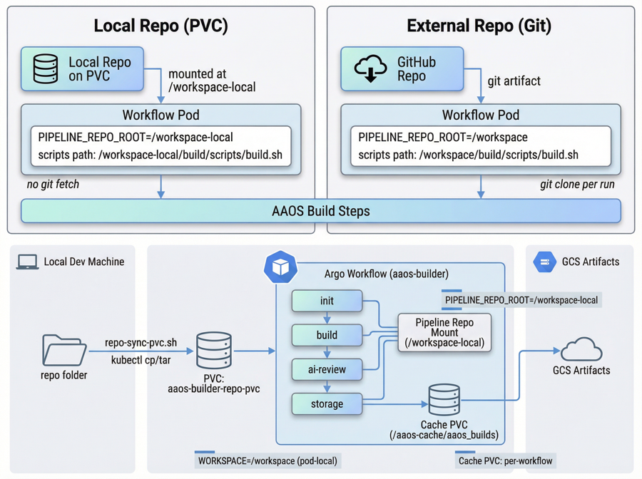

# AAOS Builder Helm Chart

This chart installs the AAOS builder Argo WorkflowTemplate. Run workflows with
`argo submit --from workflowtemplate/aaos-builder -n <namespace>` or via Argo CD.

## What’s in this chart

- `Chart.yaml`: Helm chart metadata.
- `values.yaml`: Default values; update this for configuration.
- `templates/workflow/workflowtemplates.yaml`: Argo WorkflowTemplate wrapper for the AAOS build pipeline.
- `templates/workflow/_templates.tpl`: Aggregates all split workflow templates.
- `templates/workflow/_main.tpl`: Main DAG task graph.
- `templates/workflow/_compute-vars.tpl`: Computes derived values (e.g., SDK version).
- `templates/workflow/_check-aaos-image.tpl`: Checks for the builder image in Artifact Registry.
- `templates/workflow/_clean.tpl`: Clean step template.
- `templates/workflow/_init.tpl`: Init template.
- `templates/workflow/_build.tpl`: Build template.
- `templates/workflow/_main.tpl`: Includes the ai-review step (no separate _ai-review.tpl); ai-review invokes the `ai-review` ClusterWorkflowTemplate.
- `templates/workflow/_storage.tpl`: Storage/artifact template.
- `templates/_env.tpl`: Shared Helm env helpers used in the WorkflowTemplate.
- `README.md`: This document.

## Why split templates

The workflow templates are split into per-step files to keep each task easy to find,
review, and maintain. The `templates/workflow/_templates.tpl` file aggregates them
in a stable order.

## Prerequisites

- Argo Workflows installed in the cluster
- `kubectl` and `helm` available locally (or Argo CD to sync this chart)
- The `aaos-builder-runtime-image` chart applied (WorkflowTemplate); runtime image tag must match `spec.imageBuild.imageTag` (default `argowf-latest`, distinct from a shared `:latest` tag in Artifact Registry)
- ClusterWorkflowTemplate `common-docker-image-build` from Module Manager module **`workloads-common`** (Argo child Application, wave **2**). WorkflowTemplate **`ai-review`** from **`workloads/common/agentic-ai/gemini/helm`** is a source on **`workloads-android`** (wave **3**). **WorkflowTemplates** use resource sync wave **8**.
- GKE **Workload Identity** bound for the workflow Kubernetes service account (charts do not mount a GCP JSON key)

## Platform env (gitops ConfigMap)

GitOps installs a ConfigMap `horizon-workflow-cloud-env` in the workflows namespace (see `gitops/templates/argo-workflows-init.yaml`) with **`CLOUD_PROJECT`**, **`CLOUD_REGION`**, **`CLOUD_ZONE`**, and **`HORIZON_DOMAIN`** (from gitops `config`, e.g. `config.domain`). With **`cloudEnvConfigMapName: "horizon-workflow-cloud-env"`** (default in `values.yaml`), each workflow step’s `container` / `script` includes **`envFrom`** that ConfigMap and **does not** duplicate those variables in per-step `env` blocks (see `templates/_env.tpl` define `aaos-builder.cloudEnvFrom`). **`STORAGE_LABELS`** comes only from **`workflow.parameters.storageLabels`** / **`spec.storageLabels`**, not the ConfigMap.

For local clusters without that ConfigMap, set **`cloudEnvConfigMapName: ""`** (see `values-local.yaml`) and keep **`spec.cloudProject`**, **`spec.cloudRegion`**, **`spec.cloudZone`**, and **`spec.horizonDomain`** set. Helm-templated fields such as **`STORAGE_BUCKET_BASE`** and **`aaos-builder.builderImage`** still use `spec.cloud*`; keep them aligned with the cluster ConfigMap when both are used.

## Pipeline repo (git workspace, non-local)

On **GKE** (no **`localRepoHostPath`** / **`localRepoPvcName`**), init/clean/build/storage/ai-review use **Argo `git` artifacts** so **`/workspace`** is populated from Git. Repo URL and revision are **workflow parameters** **`pipelineRepoUrl`** and **`pipelineRepoRevision`**, with defaults from **`spec.pipelineRepoUrl`** and **`spec.pipelineRepoRevision`** in `values.yaml`.

**Platform GitOps** deploys this chart (and **aaos-builder-runtime-image**) as **Helm sources** on **`workloads-android`** (`gitops/modules/workloads-android` via Module Manager), setting **`spec.pipelineRepoUrl`** and **`spec.pipelineRepoRevision`** from **`config.workloads.android.url`** and **`config.workloads.android.branch`** (passed through **`MODULE_CONFIG`**). Enable module **`workloads-android`** in Module Manager so that Application exists.

For **manual** installs or overrides, set **`spec.*`** to match those gitops keys. Example:

```bash
helm template aaos-builder workloads/android/pipelines/builds/aaos_builder/helm \
  --set spec.pipelineRepoUrl='https://github.com/your-org/your-horizon-fork.git' \
  --set spec.pipelineRepoRevision='your-branch' \
  | kubectl apply -f -
```

For a **per-run** override: `argo submit --from workflowtemplate/aaos-builder -n <ns> -p pipelineRepoUrl=... -p pipelineRepoRevision=...`.

**Private HTTPS repos:** Argo **`git` artifacts** use HTTPS username/password on the template. GitOps (**`gitops/templates/argo-workflows-init.yaml`**) wires credentials from GSM:

- **`scm.authMethod: userpass`** — GSM backs **`workflow-pipeline-git-creds`** (see **`{{ namespacePrefix }}scm-password-b64`**). For a **remote** pipeline repo, the DAG runs **ClusterWorkflowTemplate** **`prepare-pipeline-git-creds`**, which copies **`workflow.parameters.pipelineStaticGitSecretName`** (default **`workflow-pipeline-git-creds`**, or **`spec.pipelineRepoSecret`** from **`workloads-android`**) into **`{{workflow.uid}}-pipeline-git-creds`** so git artifacts use the same per-run Secret shape as **app**.
- **`scm.authMethod: app`** — ExternalSecret **`workflow-github-app`** (keys **`github-app-id-b64`**, **`github-app-private-key-pkcs8-b64`**, **`github-app-installation-id-b64`**) and **`prepare-pipeline-git-creds`**, which delegates to **`prepare-github-app-git-creds`** to mint a short-lived installation token into **`{{workflow.uid}}-pipeline-git-creds`**. With a **remote** repo, **`refresh-pipeline-git-creds-after-build`** runs the same umbrella after **`build`** so **`storage`** and **`ai-review`** clones use a fresh token.

**Local development** (`values-local.yaml` with **hostPath** or **PVC**): **git** artifacts are **omitted**; the pipeline tree is expected from the **mounted** path (`localRepoMountPath`). **`spec.pipelineRepoUrl`** / **`spec.pipelineRepoRevision`** are not used for those steps.

## Same cluster as GitOps: pause sync, local `helm apply`, resync

If Argo CD manages this WorkflowTemplate (via **`workloads-android`**), a manual `helm template | kubectl apply` (for example with **`-f values-local.yaml`**) can be **reverted** when Argo syncs from Git. To test local manifests without losing them immediately:

1. **Find the Application** (with GitOps **`namespacePrefix`**, e.g. **`dev-workloads-android`** in **`argocd`**):

   ```bash
   kubectl get applications -A | grep workloads-android
   ```

2. **Pause automated sync** (replace `APP_NAME` and `ARGOCD_NS` with values from step 1):

   ```bash
   kubectl patch application APP_NAME \
     -n ARGOCD_NS \
     --type=json \
     -p='[{"op":"remove","path":"/spec/syncPolicy/automated"}]'
   ```

3. **Apply** your chart (example with local overrides):

   ```bash
   helm template aaos-builder \
     workloads/android/pipelines/builds/aaos_builder/helm \
     -f workloads/android/pipelines/builds/aaos_builder/helm/values-local.yaml \
     | kubectl apply -n workflows -f -
   ```

4. **Resync from Git** when you want the cluster to match the repo again (one-off):

   ```bash
   argocd app sync APP_NAME
   ```

   Or use the Argo CD UI **Sync** button for that Application.

5. **Re-enable continuous sync** (optional):

   ```bash
   kubectl patch application APP_NAME \
     -n ARGOCD_NS \
     --type=merge \
     -p '{"spec":{"syncPolicy":{"automated":{}}}}'
   ```

While automated sync is off, avoid running a **Sync** on **`workloads-android`** if you still want to keep hand-applied YAML; a sync reapplies Git and overwrites **all** sources for that Application.

## Workload Identity (recommended)

1) Bind your Kubernetes service account to a Google service account.
2) Grant the GSA `roles/artifactregistry.reader` (and writer if you push images).
3) Set **`spec.useElevatedWorkflowIam: true`** (or **`spec.serviceAccountName`**) to the bound KSA per your environment.

**Terraform / Horizon SDV defaults:** by default `spec.serviceAccountName: workflow-executor` is bound to `gke-argo-workflows-sa` (`terraform/env/main.tf`, `sdv_wi_service_accounts` entry `argo_workflows`). For elevated workload IAM, set **`spec.useElevatedWorkflowIam: true`** so pods use `workflow-executor-elevated`, bound via **`argo_workflows_elevated`** to `gke-argo-workflows-elevated-sa`. Example: `helm upgrade --install ... --set spec.useElevatedWorkflowIam=true`. The Argo Workflows controller runs in namespace `argo-workflows` with `argo-workflows-server` (not used by these WorkflowTemplates).

**Sub-environment namespaces (GitOps `namespacePrefix`):** leave `namespace` empty and set `namespacePrefix` to match GitOps (e.g. `dev-`) so the WorkflowTemplate is created in `dev-workflows`. Example: `helm upgrade --install ... --set namespacePrefix=dev-`. To pin an exact name, set `namespace` (overrides the prefix rule).

## Deploy

```bash
helm template aaos-builder \
  workloads/android/pipelines/builds/aaos_builder/helm \
  | kubectl apply -f -
```

## Run (from WorkflowTemplate)

```bash
argo submit --from workflowtemplate/aaos-builder -n <namespace>
```

## Archived step logs (`main.log`) in GCS

When the cluster’s Argo Workflows controller is configured with **`artifactRepository.archiveLogs: true`** and a **GCS artifact repository** (Horizon SDV: **`gitops/templates/argo-workflows.yaml`**, bucket pattern **`<project-id>-argo-workflows`**), archived workflow logs—including **`main.log`** per step—are stored in that bucket under **per-workflow prefixes** (for example `aaos-builder-<id>/...` for nested steps such as **ai-review**).

The WorkflowTemplate also sets **`spec.archiveLogs: true`** so each submitted workflow explicitly opts in to log archival (same behavior as relying on the controller default alone).

**`<project-id>`** is the GCP project ID from gitops **`config.projectID`** (same project as the cluster; e.g. `sdva-2108202401-argo-workflows`).

For details, timestamps, and an example Cloud Console link, see **`docs/guides/argo_workflows_log_timestamps.md`** (section: *Archived logs in GCS (`main.log`)*).

## Update after changes

Re-apply the chart:

```bash
helm template aaos-builder \
  workloads/android/pipelines/builds/aaos_builder/helm \
  | kubectl apply -f -
```

If a WorkflowTemplate name changed, re-submit workflows afterward.

## Local development (hostPath)

For local clusters (Docker Desktop/Kind), you can mount the pipeline repo
from your workstation using `hostPath`:

```yaml
# values-local.yaml
localRepoHostPath: "/absolute/path/to/your/repo"
localRepoMountPath: "/workspace-local"
```

Apply with the override:

```bash
helm template aaos-builder \
  workloads/android/pipelines/builds/aaos_builder/helm \
  -f values-local.yaml | kubectl apply -f -
```

Note: leave `localRepoHostPath` empty on GKE or other remote clusters.

## Local changes on GKE (PVC-backed repo)

On GKE you cannot mount your macOS filesystem directly. Instead, sync your
local repo into a PVC, then mount that PVC into the workflow as the repo root.

## Warning

When using local, there is only one PVC for `workspace-local`, so only run a
single workflow at a time. This workspace cannot be shared across workflows and
is only intended for local development.

Diagram:



1) Sync your local repo into a PVC:

```bash
tools/scripts/repo-sync-pvc.sh \
  -n workflows \
  -p workloads-repo-pvc \
  -s "/absolute/path/to/your/repo"
```

Note: the script will **create the PVC if it does not exist** (default: `ReadWriteOnce`, `20Gi`). If you need a different size / storageClass / access mode, create the PVC yourself before running the sync.

Note: the script copies repo contents into the mount root so
`/workspace-local/workloads/...` resolves correctly.

To skip large or unnecessary directories during copy:

```bash
tools/scripts/repo-sync-pvc.sh \
  -n workflows \
  -p workloads-repo-pvc \
  -s "/absolute/path/to/your/repo"
  --exclude-git \
  --exclude-terraform \
  --clean
```

2) Set values-local.yaml:

```yaml
# values-local.yaml
localRepoPvcName: "workloads-repo-pvc"
localRepoMountPath: "/workspace-local"
```

Apply with the override:

```bash
helm template aaos-builder \
  workloads/android/pipelines/builds/aaos_builder/helm \
  -f values-local.yaml | kubectl apply -f -

# Create a workflow
argo submit --from workflowtemplate/aaos-builder -n workflows
```

## Verify mounts and paths

```bash
kubectl -n workflows exec <workflow-pod> -- sh -c 'ls -la /workspace-local | head'
kubectl -n workflows exec <workflow-pod> -- sh -c 'ls -la /workspace-local/workloads/android/pipelines/builds/aaos_builder | head'
```

## Release a stuck PV (Retain policy)

If a PV stays `Bound` to an old per‑workflow PVC:

1) Delete the PVC:

```bash
kubectl -n workflows delete pvc <pvc-name>
```

2) If deletion hangs, remove the finalizer:

```bash
kubectl -n workflows patch pvc <pvc-name> --type=json \
  -p '[{"op":"remove","path":"/metadata/finalizers"}]'
```

3) Clear the PV claimRef to make it `Available`:

```bash
kubectl patch pv <pv-name> -p '{"spec":{"claimRef":null}}'
```

## Workspace paths

`/workspace` is pod-local and not shared between tasks. Only paths on the
shared PVC (e.g., `/aaos-cache/aaos_builds`) persist across workflow steps.

## Local repo vs shared workspace

Use a local repo mount (`localRepoHostPath` or `localRepoPvcName`) when you want
the workflow to use a pre-synced repo. In that case, `PIPELINE_REPO_ROOT` points
to `/workspace-local` and the shared `/workspace` PVC can be used for
pod-to-pod artifacts.

Local repo PVCs are typically **RWO**, so only **one workflow at a time** should
use the local repo mount. External repo checkouts (`pipelineRepoUrl`) do not
share a PVC, so **multiple workflows can run in parallel**.

## Common Options (values.yaml)

- `namespace`: Namespace where WorkflowTemplate is installed
- `workflowTemplateName`: WorkflowTemplate name
- `localRepoHostPath`: hostPath for local clusters (empty on GKE)
- `localRepoPvcName`: PVC for local repo on GKE
- `localRepoMountPath`: Mount path for local repo
- `spec.lunchTarget`: AAOS lunch target
- `spec.androidRevision`: AAOS branch/tag
- `spec.cleanBuild`: `NO_CLEAN`, `CLEAN_BUILD`, `CLEAN_ALL`
- `spec.buildCtsOnly`: `true` to build CTS only
- `spec.forceImageBuild`: `true` to always rebuild the builder image
- `spec.parallelSyncJobs`: Repo sync parallelism
- `spec.enableGeminiAiAssistant`: `"true"` / `"false"` — enables ai-review on build failure (WorkflowTemplate default parameter)
- `spec.geminiSkillsYaml`: **required** path to `skills.yaml` for the ai-review step (`GEMINI_SKILLS_YAML`)
- `spec.manifestUrl`: Manifest URL for repo init
- `spec.pipelineRepoUrl`: Pipeline repo URL
- `spec.pipelineRepoRevision`: Pipeline repo revision
- `spec.pipelineRepoSecret`: Optional git credentials secret
- `spec.serviceAccountName`: Service account for workflow pods
- `spec.volumeClaimGcStrategy`: `OnWorkflowCompletion` to release per-workflow PVCs
- `spec.workflowTtlSecondsAfterCompletion`: Set seconds to auto-delete workflows
- `podGcStrategy`: Pod cleanup strategy

### Gerrit credentials (repo sync)

The chart sets **`GERRIT_CREDENTIALS_SECRET`** to **`jenkins-gerrit-http-password`** and **`GERRIT_USERNAME_KEY`** / **`GERRIT_PASSWORD_KEY`** to **`username`** / **`password`** (see `templates/_env.tpl`). GitOps defines that Secret in the **`<namespacePrefix>jenkins`** namespace (`gitops/templates/jenkins-init.yaml`). Workflow pods run in **`<namespacePrefix>workflows`**; if a step resolves it as a **namespaced** Kubernetes Secret, mirror the same object (same name and keys) into the workflow namespace or adjust consumption. The **`jenkins-gerrit-http-password`** id is shared across the platform—do not change it in Helm without renaming it everywhere it is created or referenced.

## Logs, pod status on error, and GC

Workflow step pods are labeled with the workflow name. Use that to list what is still running or recently failed:

```bash
kubectl get pods -n <namespace> -l workflows.argoproj.io/workflow=<workflow-name> -o wide
```

**Logs**

- Follow all logs for a workflow (while pods exist): `argo logs <workflow-name> -n <namespace> --follow`
- One step: `argo logs <workflow-name> -n <namespace> <node-id-or-pod-pattern>` (see `argo get` for node IDs)
- Direct from Kubernetes: `kubectl logs -n <namespace> <pod-name> -c main` (Argo’s user container is usually `main`; init uses `init`, sidecar `wait`)

If the main container restarted, inspect the previous run: `kubectl logs -n <namespace> <pod-name> -c main --previous`.

**Pod status / exit reason**

- `kubectl describe pod -n <namespace> <pod-name>` — **State**, **Exit Code**, **Reason** (e.g. `Error`, `OOMKilled`), **Events**, and **Restart Count**
- Match **`<pod-name>`** to the failing step (e.g. `…-build-…`, `…-storage-…`, `…-ai-review-…`). The **build** task’s pod reflects a real compile failure; use its logs first when the build breaks.

**How this interacts with `podGC` (`podGcStrategy`)**

This chart sets **`podGcStrategy`** on the WorkflowTemplate (default in `values.yaml`: **`OnPodSuccess`**). Argo deletes **succeeded** task pods according to that strategy (often soon after the step succeeds), so **storage** or **init** pods may disappear from `kubectl get pods` quickly even while the workflow is still running. **Failed** pods are usually kept longer so you can inspect them, but behavior is controlled by the Argo version and full **`podGC`** spec—if you only see one pod (e.g. a late failing step), others may already have been garbage-collected.

- To retain completed pods longer for debugging, consider a looser strategy (e.g. **`OnWorkflowCompletion`**) or adjust Argo’s **`podGC`** options if your controller version supports **`deleteDelayDuration`**—see [Argo pod garbage collection](https://argo-workflows.readthedocs.io/en/latest/fields/#podgc).
- Do not confuse **pod GC** with **`spec.workflowTtlSecondsAfterCompletion`**: TTL removes the **Workflow** custom resource after completion. After TTL, **`kubectl get wf`** and the Argo UI may no longer show the run unless you use **workflow archiving** (see above). Collect logs or export **`kubectl get workflow -o yaml`** before TTL if you need a permanent record.

**Summary:** For errors, use **`argo logs`** / **`kubectl logs`** and **`kubectl describe pod`** while pods exist; expect **successful** step pods to vanish early under **`OnPodSuccess`**; use **workflow YAML**, **archive**, or central logging if pods or the Workflow CR are already gone.

## AI review (Gemini)

When a build fails and `spec.enableGeminiAiAssistant` is enabled, the workflow runs the **ai-review** ClusterWorkflowTemplate (Helm chart `workloads/common/agentic-ai/gemini/helm/`). You can control behaviour with these options in `values.yaml` (under `spec`):

- **`spec.geminiPromptFile`** / **`spec.geminiPromptFile2`** / **`spec.geminiPromptFile3`** – Sequenced prompts (defaults: `prompt/sequenced/step1_triage.txt`, `step2_rca.txt`, `step3_fixes.txt` under `/workspace/.../aaos_builder/`).
- **`spec.geminiSkillsYaml`** – **Required.** Path to `skills.yaml` for `gemini_initialise` (default: same folder as the sequenced prompts). The ai-review ClusterWorkflowTemplate passes this as `GEMINI_SKILLS_YAML`; with a local repo mount, `/workspace/...` is rewritten to `localRepoMountPath` like the prompt paths.
- **`spec.geminiModel`** – Optional model pin. When set, the workflow passes `gemini --model <name> --yolo --output-format json` to ai-review; when empty, **`spec.geminiCommandLine`** is used as-is.
- **`spec.geminiPreviewFeatures`** / **`spec.geminiLocationGlobal`** – Preview and location settings for Vertex AI. With preview disabled and a non-global location, set **`spec.geminiModel`** or add **`--model <model name>`** to **`spec.geminiCommandLine`** so the CLI does not auto-select preview models.
- **`spec.geminiCommandLine`** – Full Gemini CLI invocation when **`spec.geminiModel`** is empty (e.g. `gemini --yolo --output-format json`).

## Test / Verify

```bash
kubectl get workflowtemplate -n <namespace> aaos-builder
kubectl get wf -n <namespace>
kubectl get pod -n <namespace>
```

## Optional: Archive Workflow parameters in Argo UI

To retain Workflow parameters for completed runs (so they remain visible in the
Argo UI after GC/TTL), enable Argo Workflow archiving in the controller config:

```yaml
# workflow-controller-configmap
data:
  persistence: |
    archive: true
```

This requires Argo persistence to be configured (Postgres/MySQL). Once enabled,
completed workflows appear under “Archived” in the Argo UI and include the
original parameters.

## Artifacts (optional)

To enable Argo artifact downloads (UI/CLI), configure an artifact repository
in the Argo controller config (e.g., GCS/S3/MinIO). Example (GCS):

```yaml
apiVersion: v1
kind: ConfigMap
metadata:
  name: argo-workflows-config
  namespace: argo
data:
  artifactRepository: |
    gcs:
      bucket: <bucket-name>
      keyFormat: "{{workflow.name}}/{{pod.name}}/{{artifact.name}}"
```

This workflow exports `build-info` and `build-log` artifacts from the `storage` step.

