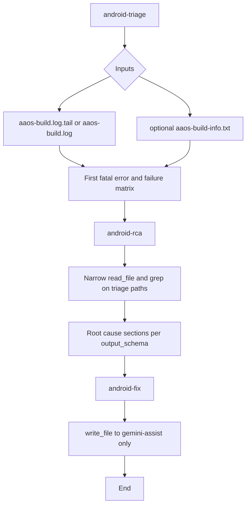

# AAOS Builder: prompts and skills (one YAML)

## Prompt vs skill

- **Prompt = task.** Short user message per sequenced step (e.g. triage, RCA, fixes) — what to do this turn.
- **Skill = instruction.** Defined in **`skills.yaml`** (**android-triage**, **android-rca**, **android-fix**): how to read logs, cap tool use, and format outputs. **`global_constraints`** apply to all three stages (latency, tool limits, search scope).

## Skill flow (logic)

Build AI Review is a **linear pipeline**: triage from build logs → RCA with narrow source search → proposed fixes under `gemini-assist/`. Stages **do not** branch on job type inside the YAML; **ABFS vs AAOS** differences are called out in **`global_constraints`** (e.g. what `aaos-build.log.tail` contains).



**ASCII:**

```
aaos-build.log(.tail) ──► triage (log-first, grep caps) ──► RCA (tree search capped) ──► fix (gemini-assist/*.md)
                                    │                           │
                         no out/ .repo wide search              run_shell_command heavily restricted
```

### Stage responsibilities

| Skill | Role | Typical inputs |
|-------|------|----------------|
| **android-triage** | First fatal error, failure matrix (Module / Toolchain / Error class) | `aaos-build.log.tail`, `aaos-build.log`, `aaos-build-info.txt` |
| **android-rca** | Dependency / file-level root cause from triage matrix | Same logs + **narrow** paths from errors |
| **android-fix** | Git-style diffs and verification commands in markdown files | Prior step output; **write_file** only under `gemini-assist/` |

## Current setup

- **`skills.yaml`** is the single source of truth (skills + `global_constraints`).
- **Prompts** live beside it (`step1_triage.txt`, etc.) — keep tasks one line where possible.
- **`gemini_initialise.sh`** converts YAML → `.gemini/skills/*/SKILL.md` when `skills.yaml` is next to the prompt path or `GEMINI_SKILLS_YAML` is set.

## Pipeline contexts

| Context | Notes |
|---------|--------|
| **Jenkins AAOS Builder** | Tail script may produce `aaos-build.log.tail` with grep highlights + last ~2500 lines. |
| **ABFS** | May copy full `aaos-build.log` to the `.tail` filename — triage semantics differ; see `global_constraints`. |
| **Argo** | May supply **aaos-build.log.tail** the same way as AAOS, depending on workflow steps. |

## Maintaining and adjusting

1. **Latency / cost** — most caps live in **`global_constraints`** (max `read_file`, `grep_search`, `run_shell_command` rules). Change there first so all stages inherit.
2. **Triage-only behavior** — edit **android-triage** `system_instructions` and **`output_schema`**; keep “log-first, no repo-wide search” unless you intentionally relax Stage 1.
3. **RCA search scope** — **android-rca** allows more tree interaction than triage; still forbid **`out/`**, **`.repo/`**, and unbounded roots — adjust wording if new tools appear.
4. **Fix filenames** — **FILENAME_RULE** in **android-fix** must stay in sync with whatever `gemini_analysis.sh` or storage steps expect.
5. **Testing** — trigger a failed build with AI Review, or point **`GEMINI_SKILLS_YAML`** at a branch `skills.yaml` in the utility job.
6. **Avoid duplicating** long procedures in prompt files; skills.yaml + thin prompts reduce drift.

## Reference

- Agent Skills: https://geminicli.com/docs/cli/skills/
- Creating skills: https://geminicli.com/docs/cli/creating-skills/
- Related: ABFS may reference the same skill shapes — align `skills.yaml` copies if both are maintained.
