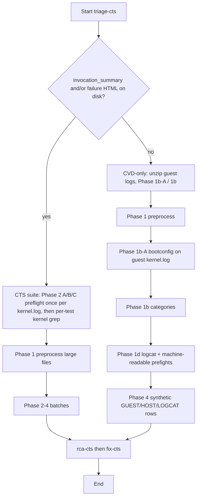

# CTS execution: prompts and skills (one YAML)

## Prompt vs skill

- **Prompt = task.** The prompt file is the *task* for this run: the short invocation (e.g. "Run triage on the test results in test-results", workspace-relative). Keep it to one line; it is sent as the user message.
- **Skill = instruction.** The skill (in `skills.yaml`) is the *instruction*: how to do it. It defines role, procedure (steps to follow), rules, and output format—no "Task:" headings; use "Procedure:" or "Steps" in the skill so the prompt remains the only "task."

## Skill flow (logic)

`triage-cts` branches on **Phase 0**: whether **Tradefed suite artifacts** exist on disk — **`invocation_summary.txt`** and/or **`test_result_failures_suite.html`** under **`test-results/`**, or the same filenames under workspace **`android-cts-results/`** / **`android-cts-results-html/`** (see **`cts_execution.sh`**). **Failing `test_result*.xml` alone does not select suite mode.** If yes → **CTS suite** (failed tests from HTML when present, else summary + XML; then CVD log cross-reference). In suite mode, **`KERNEL_PREFLIGHT_HITS`** comes from **one** pass of **`global_constraints` → Obvious guest `kernel.log` greps** (A/B/C) in **Phase 2 — Suite kernel preflight** only — **not** a duplicate sweep before Tradefed work; **reuse** the same preflight line across XML/HTML batches. Per-test **`kernel.log`** greps follow. Add team patterns under **C** in `skills.yaml` `global_constraints`. If **none** of those artifacts → **CVD-only** (guest `kernel.log` first: obvious A/B/C **before** Phase 1b, then same depth as CVD Launcher sequenced skills).



**ASCII:**

```
Suite artifacts (summary/HTML)? ──yes──► suite: Phase 2 A/B/C once per guest kernel.log (KERNEL_PREFLIGHT_HITS), then grep kernel per test ──► rca/fix
                               │
                               no ──► CVD-only: guest kernel.log → 1b/1c–1f → logcat (exception-first Phase 1d) → prefights → Phase 4 ──► rca/fix
```

### Mode cheat sheet

| Mode | When | Guest `kernel.log` |
|------|------|-------------------|
| **CTS suite** | **Any** of **`test-results/invocation_summary.txt`**, **`test-results/test_result_failures_suite.html`**, **`android-cts-results/invocation_summary.txt`**, **`android-cts-results-html/test_result_failures_suite.html`** | **Phase 2** obvious A/B/C **once** per guest `kernel.log` (`KERNEL_PREFLIGHT_HITS`), then per-test grep — **no** full Phase 1b; no **`[GUEST_KERNEL_*]`** rows |
| **CVD-only** | **None** of those files on disk (including when `test_result*.xml` reports failures) | **Same depth as CVD Launcher `triage-cvd`:** Phase 1b + **1c–1f** (`launcher.log`, logcat, WiFi, host correlation); **machine-readable prefights** (`KERNEL_PREFLIGHT_HITS` / `LOGCAT_PREFLIGHT_HITS`) **before** the Phase 4 table; then **`RECOMMENDED_NEXT_STEP:`** may point at **CVD Launcher** (`preset: 'cvd'`) for a dedicated second pass |

### fix-cts — proposed_fix artifacts (suite vs CVD-only)

All remediation files live under **`gemini-assist/`** only (`skills.yaml` → **`fix-cts`**). **File count** depends on the same Phase 0 gate as triage:

| Branch | Rule |
|--------|------|
| **CTS suite** (any of **`invocation_summary.txt`** / **`test_result_failures_suite.html`** on disk, or **`android-cts-results*`** mirrors) | **One** `gemini-assist/proposed_fix_*.md` **per** distinct failing **`Test#Method`** from Step 1 that Step 2 still treats as actionable — **including** when every failure is blamed on “environment”, “systemic instability”, or “provisioning.” **Count R** = rows in Step 1’s failure table: if **R ≥ 2** and no **`(xN identical)`** fold, emit **≥ R** files — **never** exactly **one** suite-wide speculative AOSP patch (e.g. `SystemServer`) for the whole table unless Step 2 ties **each** test to that path with evidence. **Do not** collapse **N** methods into **one** umbrella `[INFRASTRUCTURE_FAILURE]` artifact **unless** Step 1 folded them with **`(xN identical)`** (same signature). Each file’s **`## [FAILURE_ID] Summary`** must use the **full** **`Test#Method`** string from Tradefed. |
| **CVD-only** (no suite artifacts) | **One** file per distinct root cause / signature group (align with triage **`(xN identical)`**); **`FAILURE_ID`** may be **`[HOST_*]`** / infra style when there is no `Test#Method`. |

**FLAKY_TEST** rows: either one file per method or a **single** `proposed_fix_flaky_batch_*.md` with a **subsection per `Test#Method`** — see **`fix-cts`** in `skills.yaml`.

### Guest `kernel.log` scan windows (`global_constraints`)

Bounded reads of guest **`kernel.log`** use **one rule** everywhere (obvious A/B/C greps, suite **Phase 2** preflight, CVD-only **Phase 1b-A** / category sweep): **whole-file `grep` when ≤ 20MB**; if **> 20MB**, use **`grep -n` on the path** and **`tail`** only as allowed by the file-size guardrails. Any **line-bounded head** window must cover at least the **first 8000 lines** (never a smaller head such as 2500). Optional **`tail -n 5000`** when a late failure is plausible. Details live in **`skills.yaml` → `global_constraints` → Guest `kernel.log` scan windows**.

### Logcat (`[LOGCAT_*]`) — exception-first (CVD-only Phase 1d)

**`triage-cts`** Phase **1d** matches **`triage-cvd`** (CVD Launcher): **one early combined `grep -nE`** on each logcat file for **native + Java** crash signals (`Fatal signal|SIGSEGV|SIGABRT|tombstone|FATAL EXCEPTION|AndroidRuntime|RuntimeException`), then classify hits as tier 1 vs 2 for **`LOGCAT_PREFLIGHT_HITS`**. **Tiers 3–5** (ANR, framework, DEBUG) run **only when** tiers 1–2 are empty or triage is still ambiguous — see Phase 1d in `skills.yaml`. The **`[LOGCAT_*]`** row in **`global_constraints`** still summarizes the tier **reference**; full procedure is in Phase 1d.

### Host vs guest in Cuttlefish (CVD) logs

When **`triage-cts`** is in **CVD-only** mode, synthetic **`failure_id`** values follow the same host/guest split as [CVD Launcher](../../../cvd_launcher/prompt/sequenced/README_SKILLS.md#guest_kernel-vs-host-identifiers-cuttlefish-logs):

- **`[GUEST_KERNEL_*]`** — **Guest** virtual device, **`kernel.log`** (bootconfig, panic, init, etc.).
- **`[HOST_*]`** — **Host** Cuttlefish orchestration (flattened **`cvd-*.log`**, launch/stop, infra), not the guest kernel table.

In **CTS suite** mode, rows use **`Test#Method`** from Tradefed instead; guest kernel lines appear only as **evidence** under each test row (no **`[GUEST_KERNEL_*]`** / **`[HOST_*]`** synthetic IDs).

**CVD-only error signals (grep):** In **CVD-only** mode, **`skills.yaml`** → **`global_constraints`** → **“CVD errors — what to do”** matches CVD Launcher (procedure + table; not exhaustive); **triage-cts** Phase 1b+ widens the sweep; use step 4 there when the failure is non-obvious.

## Scope: this bundle vs CVD Launcher

- **This directory** (`cts_execution/prompt/sequenced`) is for the **CTS Execution** job with **`aiReview.preset: 'cts'`**. Skills are built around **Tradefed**: when suite artifacts exist, triage starts from **failed tests**, then cross-references **CVD/guest logs** per test. When no suite artifacts exist, the **CVD-only** branch still runs inside this job (guest-first, similar guest-log discipline to below).
- **[CVD Launcher](../../../cvd_launcher/prompt/sequenced/README_SKILLS.md)** uses **`cvd_launcher/prompt/sequenced`** with **`preset: 'cvd'`**. That job **does not run CTS**; its prompts are **only** for **Cuttlefish / CVD runtime** (guest `kernel.log`, launcher, host `cvd` orchestration, boot failures). Use it when you want analysis **dedicated to virtual-device runtime**, not Compatibility Test Suite results.
- Narrative for users and when to pick which pipeline: [CTS Execution user doc](../../../../../../../docs/workloads/android/tests/cts_execution.md#cts-vs-cvd-launcher-scope) (section *CTS vs CVD Launcher (scope)*) and [CVD Launcher user doc](../../../../../../../docs/workloads/android/tests/cvd_launcher.md).

## Current setup

- **skills.yaml** defines the three skills (**triage-cts**, **rca-cts**, **fix-cts**) with full `system_instructions`. Single source of truth for behavior.
- **Prompts** are one-line tasks only (`step1_triage.txt`, …). No duplication of skill content.
- The Gemini scripts convert `skills.yaml` to `.gemini/skills/*/SKILL.md` at run time (`gemini_skills_from_yaml.py`).

## How skills are loaded

The **Gemini AI stage** (via `gemini_initialise.sh`): if `GEMINI_SKILLS_YAML` is set to a file path, or if `skills.yaml` is found next to the prompt path, it runs `gemini_skills_from_yaml.py` to write `.gemini/skills/<name>/SKILL.md` from the YAML (requires Python and PyYAML).

**CTS execution** (prompt path set to `.../sequenced/`): the script finds `skills.yaml` in that dir and converts it. No extra parameters needed.

**Pipeline wiring:** the CTS job’s Jenkinsfile uses `cvdPipeline` with hooks from `ctsCvdPipelineHooks` (see `workloads/common/jenkins/shared-libraries/cvd-pipeline-shared-library/vars/README.md`).

**CVD Launcher** uses `cvd_launcher/prompt/sequenced` when `aiReview.preset: 'cvd'`. Override with `aiReview.promptSequencedDir` if needed. See **[Scope: this bundle vs CVD Launcher](#scope-this-bundle-vs-cvd-launcher)** above.

**Gemini AI Assistant** (uploaded prompts): set `GEMINI_SKILLS_YAML` to this file’s path.

## Maintaining and adjusting

1. **Edit `skills.yaml` in place** — prompts stay thin; put procedure changes in the relevant skill’s `system_instructions` or `global_constraints`.
2. **Suite vs CVD-only** — suite mode when **any** of **`invocation_summary.txt`** / **`test_result_failures_suite.html`** (under **`test-results/`** or **`android-cts-results*`**). Use failing **`test_result*.xml`** for detail; **XML alone** does not select suite mode. Adjust if jobs change artifact layout. **fix-cts:** in suite mode, keep **one `gemini-assist/proposed_fix_*.md` per `Test#Method`** (see [fix-cts — proposed_fix artifacts](#fix-cts--proposed_fix-artifacts-suite-vs-cvd-only)); change **`fix-cts`** and this README together if you relax or tighten that rule.
3. **Guest vs host logs** — rules live in `global_constraints` and **CVD-only** bullets: always prioritize `test-results/cvd/**/logs/kernel.log` over flattened `test-results/cvd-*.log` when both exist.
4. **Bootconfig misses** — tighten **Phase 1b-A** strings or the “FORBIDDEN” lines in CVD-only mode.
5. **Shared CVD content** — These blocks are kept in lockstep with [CVD Launcher `skills.yaml`](../../../cvd_launcher/prompt/sequenced/skills.yaml); change **both** in one PR:
   - **`global_constraints` → “CVD errors — what to do”** (table + steps)
   - **`global_constraints` → Obvious guest `kernel.log` greps** (A/B/C) and **Guest `kernel.log` scan windows**
   - **Phase 1d** logcat **exception-first** procedure and tier reference (**`triage-cts`** CVD-only branch ↔ **`triage-cvd`**)
6. **Phase numbering vs CVD Launcher** — CVD Launcher emits the main triage **Phase 3** table; CTS Execution uses **Phase 4** for the same machine-readable table. Prefight markdown sections are the same; only the phase number differs.
7. **Test before merge** — run a failed CTS job with AI Review enabled, or use the Gemini utility with `GEMINI_SKILLS_YAML` pointed at your branch copy.
8. **Do not** duplicate long instructions in `step*.txt`; one-line task + skill body avoids drift.

## Reference

- Agent Skills: https://geminicli.com/docs/cli/skills/
- Creating skills: https://geminicli.com/docs/cli/creating-skills/
- User doc: [CTS Execution](../../../../../../../docs/workloads/android/tests/cts_execution.md) — includes [CTS vs CVD Launcher (scope)](../../../../../../../docs/workloads/android/tests/cts_execution.md#cts-vs-cvd-launcher-scope)
- CVD Launcher user doc: [cvd_launcher.md](../../../../../../../docs/workloads/android/tests/cvd_launcher.md)
