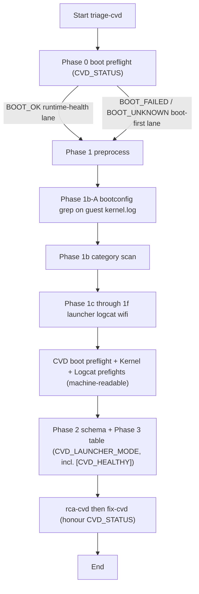

# CVD Launcher: prompts and skills (one YAML)

## Prompt vs skill

- **Prompt = task.** One-line user message for each sequenced step (`step1_triage.txt`, `step2_rca.txt`, `step3_fixes.txt`).
- **Skill = instruction.** Defined in `skills.yaml` (**triage-cvd**, **rca-cvd**, **fix-cvd**): Cuttlefish **guest** logs first (`kernel.log`, `launcher.log`), then host orchestration (`cvd-*.log`), WiFi, and logcat.

## Skill flow (logic)

Analysis is **guest-first Cuttlefish triage**: **`kernel.log`** / **`launcher.log`** dominate; host **`cvd-*.log`** is supplementary. A **Phase 0 boot preflight** runs first and classifies **`CVD_STATUS`** as **`BOOT_OK`**, **`BOOT_FAILED`**, or **`BOOT_UNKNOWN`** — the rest of triage is routed by that classification.



**ASCII:**

```
  Phase 0: CVD boot preflight  →  classify CVD_STATUS
                                      │
             ┌────────────────────────┴────────────────────────┐
             │                                                 │
          BOOT_OK                            BOOT_FAILED / BOOT_UNKNOWN
   (runtime-health lane)                      (boot-first lane — existing)
             │                                                 │
             └────────────────────────┬────────────────────────┘
                                      ▼
                            Phase 1 preprocess
                 →  1b-A bootconfig grep (guest kernel.log)
                 →  1b category scan
                 →  1c–1f (launcher, logcat, wifi)
                                      ▼
                Prefights (machine-readable, above Phase 3):
                   1. ## CVD boot preflight
                   2. ## Kernel preflight
                   3. ## Logcat preflight
                                      ▼
                   Phase 3 table  →  rca-cvd  →  fix-cvd

  Rules:
    • Never trust flattened cvd-*.log alone when
      test-results/cvd/**/logs/kernel.log exists.
    • BOOT_OK      → logcat primary, bootconfig informational;
                     emits [CVD_HEALTHY]/[NO_RUNTIME_ISSUE] when clean.
    • BOOT_FAILED  → [GUEST_BOOT_FAILED] rows mandatory (unchanged).
    • BOOT_UNKNOWN → run both sweeps; prefer the worse outcome.
```

### Phase 0 — CVD boot preflight (dual-lane routing)

`global_constraints` → **Phase 0 — CVD boot preflight** reads artifacts only (no pipeline state, so CVD Launcher and Utilities / Gemini AI Assistant produce the same classification for the same `test-results/`). Signals:

1. Host **`"status":"Running"`** JSON in `test-results/cvd-*.log` and `**/launcher.log`.
2. Per-guest **`VIRTUAL_DEVICE_BOOT_COMPLETED`** in `test-results/cvd/cvd-*/logs/kernel.log` / `launcher.log`.
3. Strong negatives (**`VIRTUAL_DEVICE_BOOT_FAILED`**, `Kernel panic`, `Oops:`, `Unable to mount`) — force **`BOOT_FAILED`** regardless of (1)/(2).

Triage emits a **`## CVD boot preflight`** header (with `CVD_STATUS`, `GUESTS_EXPECTED`, `GUESTS_RUNNING`, `EVIDENCE`) **above** the Kernel/Logcat prefights.

| `CVD_STATUS` | Lane | Phase 1b-A | Phase 1d logcat | When no actionable rows |
|---|---|---|---|---|
| **`BOOT_OK`** | runtime-health | **scan only** (informational) | **primary** | one row `[NO_RUNTIME_ISSUE]` in bucket **`[CVD_HEALTHY]`** |
| **`BOOT_FAILED`** | boot-first (existing) | **mandatory** `[GUEST_BOOT_FAILED]` rows | per skill | existing behaviour |
| **`BOOT_UNKNOWN`** | pessimistic | run both sweeps, prefer worse outcome | per skill | existing behaviour |

**`rca-cvd`** and **`fix-cvd`** honour the same classification: on `[CVD_HEALTHY]` they do **not** fabricate AOSP diffs — `fix-cvd` writes a single `gemini-assist/proposed_fix_runtime_observations_<ts>.md` or returns **`FIX_UNKNOWN: no action required.`**.

### Artifact priority (short)

1. `test-results/cvd/cvd-*/logs/kernel.log` — bootconfig, panic, init  
2. Same instance `launcher.log` — crosvm / assemble  
3. Flattened `test-results/cvd-<build>.log` — timing / `VIRTUAL_DEVICE_BOOT_FAILED` only after guest logs scanned  

### GUEST_KERNEL vs HOST identifiers (Cuttlefish logs)

Cuttlefish splits **host** (Linux side running `cvd` / crosvm / ADB) from **guest** (the virtual Android device). Skills use that split in **`failure_id`** labels:

| Label | Meaning | Typical log paths |
|-------|---------|-------------------|
| **`[GUEST_KERNEL_*]`** | Evidence from the **guest** VM’s **kernel** ring buffer — bootconfig, panic, init, mount, early boot. | `test-results/cvd/cvd-*/logs/kernel.log` (after unzip) |
| **`[HOST_*]`** | **Host-side** Cuttlefish orchestration — launch/stop, assemble, instance dirs, flattened **`cvd-*.log`** timing / `VIRTUAL_DEVICE_BOOT_FAILED` without the guest smoking gun. | `test-results/cvd-*.log`, host `cvd` CLI lines |
| **`[LOGCAT_*]`** (when used) | Guest **userspace** / logcat-like files under `test-results`, not the kernel table. | `logcat` or similar under `test-results/cvd/**` |
| **`[CVD_HEALTHY]`** (Phase 0 `BOOT_OK` only) | Runtime-health lane produced no actionable findings; emitted with `failure_id` **`[NO_RUNTIME_ISSUE]`**. Signals to **`rca-cvd`** / **`fix-cvd`** not to synthesize fixes. | n/a — derived from Phase 0 + empty Phase 1/1d |

**Why “guest” and “kernel” together:** **`launcher.log`** is still guest-side but not the kernel; **`GUEST_KERNEL_*`** marks rows tied specifically to **`kernel.log`** Phase 1b / 1b-A (so triage does not confuse host wrapper noise with guest boot failures).

### Guest `kernel.log` scan windows (`global_constraints`)

Bounded reads of guest **`kernel.log`** use **one rule** for obvious A/B/C greps and **Phase 1b-A** / category sweep: **whole-file `grep` when ≤ 20MB**; if **> 20MB**, use **`grep -n` on the path** and **`tail`** only as allowed by the file-size guardrails. Any **line-bounded head** window must cover at least the **first 8000 lines**. Optional **`tail -n 5000`** when a late failure is plausible. Full text: **`skills.yaml` → `global_constraints` → Guest `kernel.log` scan windows**.

### Logcat (`[LOGCAT_*]`) — exception-first (Phase 1d)

**`triage-cvd`** Phase **1d** uses **one early combined `grep -nE`** per logcat file for **native + Java** crash lines (`Fatal signal|SIGSEGV|SIGABRT|tombstone|FATAL EXCEPTION|AndroidRuntime|RuntimeException`), then classifies **tier 1** vs **tier 2** for **`LOGCAT_PREFLIGHT_HITS`**. **ANR / framework / DEBUG** tiers run **only when** tiers 1–2 are empty or triage is still ambiguous — see Phase 1d in `skills.yaml`. The **`[LOGCAT_*]`** row in **`global_constraints`** summarizes the tier **reference**. **CTS Execution** **`triage-cts`** (CVD-only branch) matches this procedure.

### Machine-readable prefights (before Phase 3 table)

**`triage-cvd`** emits three prefight sections **above** the Phase 3 markdown table, in this order:

1. **`## CVD boot preflight`** (Phase 0) — `CVD_STATUS`, `GUESTS_EXPECTED`, `GUESTS_RUNNING`, `EVIDENCE`.
2. **`## Kernel preflight (machine-readable)`** with **`KERNEL_PREFLIGHT_HITS:`** (after Phase 1b).
3. **`## Logcat preflight (machine-readable)`** with **`LOGCAT_PREFLIGHT_HITS:`** (after Phase 1d).

**[CTS Execution](../../../cts_execution/prompt/sequenced/README_SKILLS.md)** reuses the Kernel / Logcat prefights **before its Phase 4** table when **`MODE: CVD_ONLY`**; the **`## CVD boot preflight`** section is **CVD Launcher only** — it is **not** part of the shared CVD-block with CTS.

**CVD error signals (grep):** **`skills.yaml`** → **`global_constraints`** → **“CVD errors — what to do”** — line-number grep, table of buckets/paths/example substrings (not exhaustive), then widen with **triage-cvd** Phase 1b+; if non-obvious, follow the same section’s step 4 (context, other logs, inference).

## Scope: this bundle vs CTS Execution

- **This directory** (`cvd_launcher/prompt/sequenced`) is for the **CVD Launcher** job with **`aiReview.preset: 'cvd'`**. Skills are **Cuttlefish / CVD runtime only** (guest `kernel.log`, `launcher.log`, host `cvd` orchestration, WiFi, logcat). The job **does not run** the Compatibility Test Suite (Tradefed).
- **[CTS Execution](../../../cts_execution/prompt/sequenced/README_SKILLS.md)** uses **`cts_execution/prompt/sequenced`** with **`preset: 'cts'`** — failed-test correlation from Tradefed HTML/XML when present, plus a **CVD-only** branch in the same job when suite artifacts are missing. Use that pipeline when you need **CTS results** and per-test log correlation.
- User-facing comparison: [CVD Launcher](../../../../../../../docs/workloads/android/tests/cvd_launcher.md) and [CTS Execution](../../../../../../../docs/workloads/android/tests/cts_execution.md#cts-vs-cvd-launcher-scope) (*CTS vs CVD Launcher (scope)*).

## Current setup

- **`skills.yaml`** defines **triage-cvd**, **rca-cvd**, **fix-cvd** with full `system_instructions`. Single source of truth for behavior.
- **Prompts** are one-line tasks (`step1_triage.txt`, …). No duplication of skill content.
- **`gemini_initialise.sh`** converts `skills.yaml` to `.gemini/skills/*/SKILL.md` when `skills.yaml` sits next to the prompt path or **`GEMINI_SKILLS_YAML`** points at this file.

## How skills are loaded

The Gemini AI stage (`gemini_initialise.sh`) loads `skills.yaml` next to the prompt directory or via **`GEMINI_SKILLS_YAML`**. This directory is the default when the pipeline sets **`aiReview.preset: 'cvd'`** (see **`cvdPipeline`** **Diagnostics** / **AI Review**). Override the prompt directory with **`aiReview.promptSequencedDir`** if needed. See **[Scope: this bundle vs CTS Execution](#scope-this-bundle-vs-cts-execution)** when choosing between CVD Launcher and CTS Execution AI Review.

Pipeline details: `workloads/common/jenkins/shared-libraries/cvd-pipeline-shared-library/vars/README.md`.

### Reuse via Utilities / Gemini AI Assistant (offline, success or failure)

The same prompts + `skills.yaml` can be driven from [Workloads → Utilities → Gemini AI Assistant](../../../../../../../docs/workloads/utilities/gemini_ai_assistant.md) against archived `test-results/` of any prior CVD Launcher **or** CTS Execution build — no pipeline re-run required. Upload:

- **`GEMINI_PROMPT_FILE`** ← `step1_triage.txt`
- **`GEMINI_PROMPT_FILE_2`** ← `step2_rca.txt`
- **`GEMINI_PROMPT_FILE_3`** ← `step3_fixes.txt`
- **`GEMINI_SKILLS_YAML`** ← `skills.yaml`

…and set **`GEMINI_ARTIFACTS_COMMAND`** to copy the archived results (e.g. `gcloud storage cp -r gs://…/<BUILD_NUMBER>/test-results/ .`). Phase 0 classifies `CVD_STATUS` from the artifacts and the dual-lane routing above applies identically. Always prefer this CVD set over the CTS Execution sequenced prompts when the focus is CVD / Cuttlefish boot or runtime.

**`GEMINI_ANALYSE_ON_SUCCESS=true`** (on the CVD Launcher or CTS Execution build itself) controls whether in-pipeline AI Review runs and therefore whether `gemini-assist/`, `step*_output.md`, and `headless_output*.json` are archived with a **passing** build; enable it if you want those artifacts alongside a green build. The utility-job entry point above does not need it — it reads `test-results/` directly.

## Maintaining and adjusting

1. **Edit `skills.yaml` in place** — put procedure changes in the relevant skill’s `system_instructions` or `global_constraints`.
2. **Keep `step1_triage.txt` to one line** (task only).
3. **Bootconfig / host-log confusion** — adjust `global_constraints` and **Phase 1b-A** if models anchor on `cvd-*.log` only.
4. **New CVD grep examples** — edit **`global_constraints` → “CVD errors — what to do”** (table and numbered steps) **and** Phase 1b in the same change. The table is **also** in **`cts_execution/prompt/sequenced/skills.yaml`** for CVD-only mode — keep both files in lockstep. Do not duplicate long lists in `step*.txt`.
5. **Shared blocks with CTS Execution** — change **both** YAMLs in one PR when touching any of: **Guest `kernel.log` scan windows**, **Obvious guest `kernel.log` greps** (A/B/C), **Phase 1d** logcat **exception-first** procedure / tier reference, or the **`[LOGCAT_*]`** summary row. The **Phase 0 — CVD boot preflight** block is **CVD Launcher only** and is **not** in the shared region — edit it here without touching the CTS `skills.yaml`.
6. **Phase numbers vs CTS** — this bundle’s triage table is **Phase 3** (with a **Phase 0** boot preflight ahead of it); CTS Execution uses **Phase 4** for the equivalent table and has **no Phase 0** — Tradefed first / CVD-only branch handles its routing. Kernel / Logcat prefight sections are aligned; only numbering differs.
7. **`[CVD_HEALTHY]` / `[NO_RUNTIME_ISSUE]`** — when extending buckets or prompts, keep the rule that this bucket is emitted **only** in the `BOOT_OK` lane and **only** when no actionable findings exist; **`rca-cvd`** / **`fix-cvd`** must not fabricate findings for it.
8. **Test** with (a) a failed CVD Launcher run — `cuttlefish_logs*.zip` + `cvd*.log` — to exercise the `BOOT_FAILED` lane, and (b) a passing run with `GEMINI_ANALYSE_ON_SUCCESS=true` (or a successful build fed through Utilities / Gemini AI Assistant) to exercise the `BOOT_OK` / `[CVD_HEALTHY]` lane.

## Reference

- Agent Skills: https://geminicli.com/docs/cli/skills/
- Creating skills: https://geminicli.com/docs/cli/creating-skills/
- User doc: [CVD Launcher](../../../../../../../docs/workloads/android/tests/cvd_launcher.md) — see also [CTS vs CVD Launcher (scope)](../../../../../../../docs/workloads/android/tests/cts_execution.md#cts-vs-cvd-launcher-scope) on the CTS Execution page
- CTS Execution skills README (Tradefed / `preset: 'cts'`): [README_SKILLS.md](../../../cts_execution/prompt/sequenced/README_SKILLS.md)
